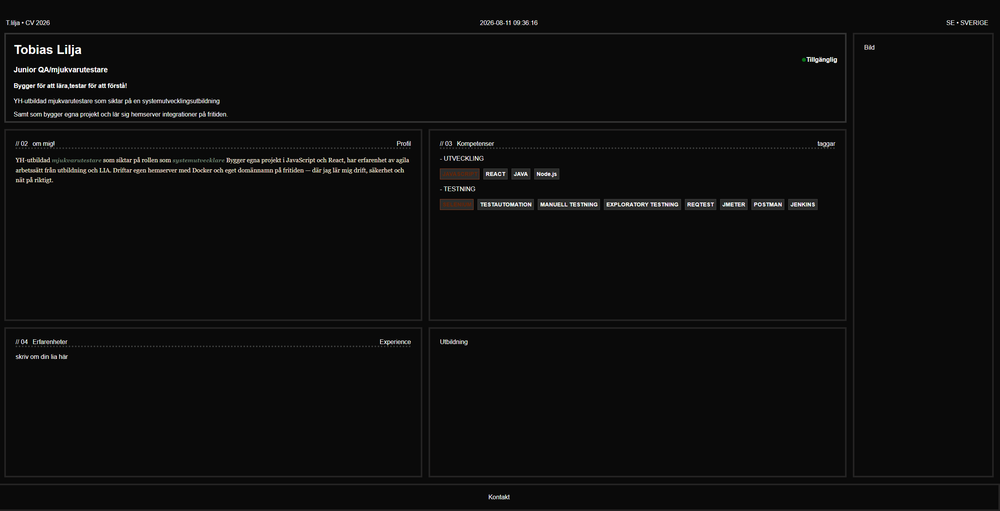

# Personal Portfolio

My personal CV/portfolio website — presents my background, experience, technical skills and personal projects, with a focus on software development and software testing.

  

## Live

Hosted via GitHub Pages: https://toblilj.github.io/resume-webpage/

## Current status

The site is feature-complete for launch and contains:

- Profile / hero
- About me
- Skills (development, testing, drift, method)
- Experience timeline
- Interactive terminal (try `help` in the "Hemserver" panel)
- Contact

The terminal's `ls` command currently shows static demo data — it's built to later swap in a real read-only status endpoint from my home server without changing any of the display code.

## Tech Stack

- HTML / CSS
- Vanilla JavaScript

A React rewrite is planned as a learning project further down the line, but the current site is intentionally hand-written vanilla JS to practice core language fundamentals first.

## Why I'm building this

I'm building this project as both a personal portfolio and a way to practice frontend development, UI design and project structure — writing the logic myself rather than relying on a framework, to build a solid understanding of the underlying syntax first.

## Roadmap

- [x] Complete experience section
- [x] Add profile picture
- [x] Improve responsive design
- [x] Add contact section
- [x] Add terminal
- [x] Deploy first version
- [ ] Connect terminal `ls`/`uptime` to a real read-only status API on my home server
- [ ] Add projects section
- [ ] React rewrite

## Status

✅ Launched — actively iterating.
